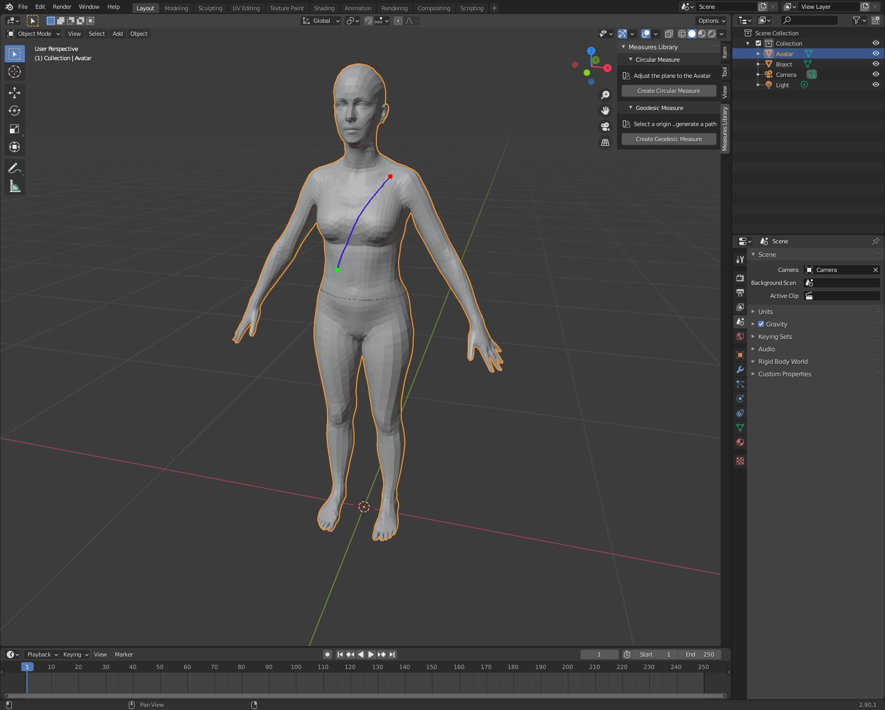
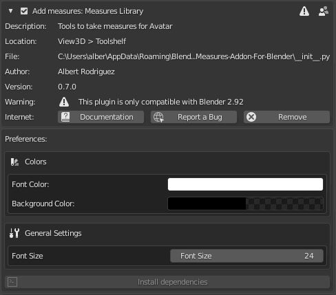

# Measures Addon For Blender

  

This Blender addon is intended to accelearate the creation of measures for an Avatar.

## Running locally
The plugin requires the following tools to run:

- [Blender 2.9+](https://www.blender.org/download/)
- [Visual Studio Code](https://code.visualstudio.com/)
- [Python for Visual Studio Code](https://marketplace.visualstudio.com/items?itemName=ms-python.python)
- [Blender Development](https://marketplace.visualstudio.com/items?itemName=JacquesLucke.blender-development)

Follow the instructions of the Blender Development plugin setup to connect to your instance of Blender.

## Installing in Blender
If you simply want to test how the addon works, get the latest version of the addon from the releases page. 

Inside Blender go to: `Edit > Preferences`, go the the `Add-ons` section in the left menu, hit the `Install...` button and select the file you donwloaded.

Now at the top of the section in the search box if you type `Measures` the plugin should appear.

  

## Useful Links:
- [Blender Python API docs](https://docs.blender.org/api/current/)
- [Blender Python Tutorial, Youtube series by Darkfall](https://www.youtube.com/watch?v=cyt0O7saU4Q&list=PLFtLHTf5bnym_wk4DcYIMq1DkjqB7kDb-&index=1)
- [Blender Python Addon Development with ST3, Udemy Course](https://www.udemy.com/course/st3-addon-course/)

More coming soon...