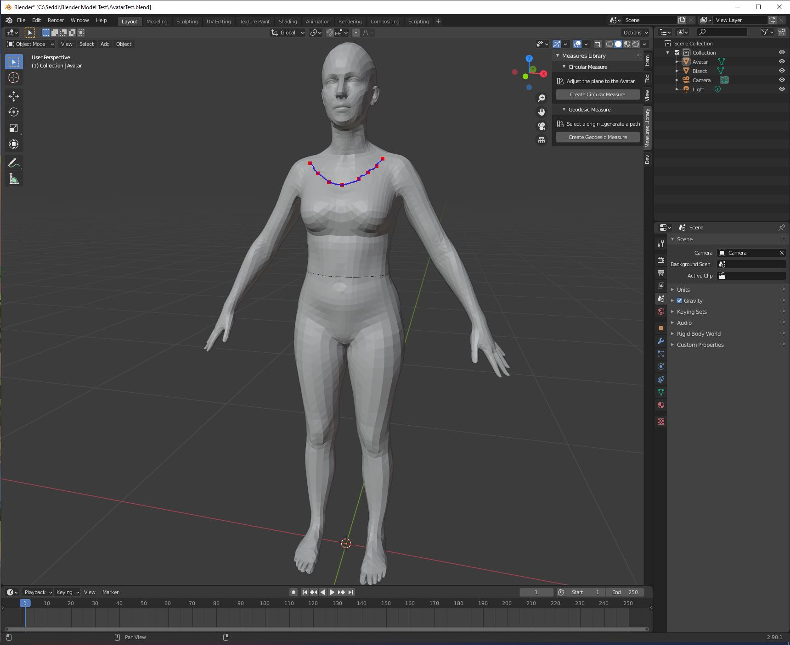

# Measures Addon For Blender

  

This Blender addon is intended to accelerate the creation of measures for an Avatar.

## Features
- Circular measures using bisection
- Connected multi-segment polilines using geodesic paths

## Developing the plugin
Install the following tools:

- [Blender 2.92](https://download.blender.org/release/Blender2.92/) **Other versions won't work**
- [Visual Studio Code](https://code.visualstudio.com/)
- [Python for Visual Studio Code](https://marketplace.visualstudio.com/items?itemName=ms-python.python)
- [Blender Development](https://marketplace.visualstudio.com/items?itemName=JacquesLucke.blender-development)

Follow the instructions of the Blender Development plugin setup to connect to your instance of Blender.

## Installing in Blender
If you simply want to test how the addon works, get the latest version of the addon from the [releases page](https://github.com/UncleFirefox/Measures-Addon-For-Blender/releases).

**Remember, only Blender 2.92 works with this plugin**

Inside Blender go to: `Edit > Preferences`, go the the `Add-ons` section in the left menu, hit the `Install...` button and select the file you donwloaded.

Now at the top of the section in the search box if you type `Measures` the plugin should appear.

  

Once the plugin is installed you'll see an "Install dependencies" button at the bottom. This addon uses dependencies not included with the standard built in set of libraries. That button automates that process. Make sure you run with elevated privileges before attempting the install. Once successful the button will be greyed out.

You can install different versions of the plugin and activate the one you want to try.

  

## Useful Links:
- [Blender Python API docs](https://docs.blender.org/api/current/)
- [Blender's Scripting for Artists Youtube Channel](https://www.youtube.com/watch?v=opZy2OJp8co&list=PLa1F2ddGya_8acrgoQr1fTeIuQtkSd6BW)
- [Jayanam Python for Blender Youtube Series](https://www.youtube.com/watch?v=ajPl4Kcv8tk&list=PLboXykqtm8dyUUJ6bZZFmFijFWpZzKx6F)
- [Blender Python Tutorial, Youtube series by Darkfall](https://www.youtube.com/watch?v=cyt0O7saU4Q&list=PLFtLHTf5bnym_wk4DcYIMq1DkjqB7kDb-&index=1)
- [Blender Python Addon Development with ST3, Udemy Course](https://www.udemy.com/course/st3-addon-course/)
- [Curtis Holt Crash Course](https://www.youtube.com/watch?v=XqX5wh4YeRw)